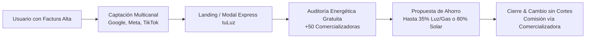
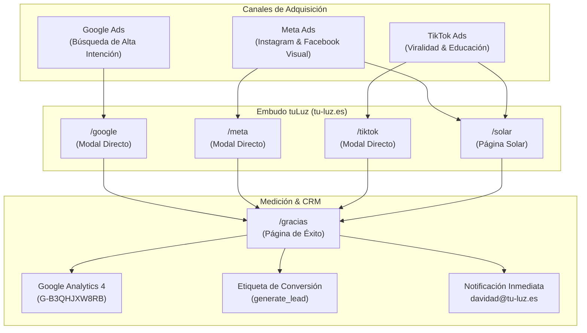
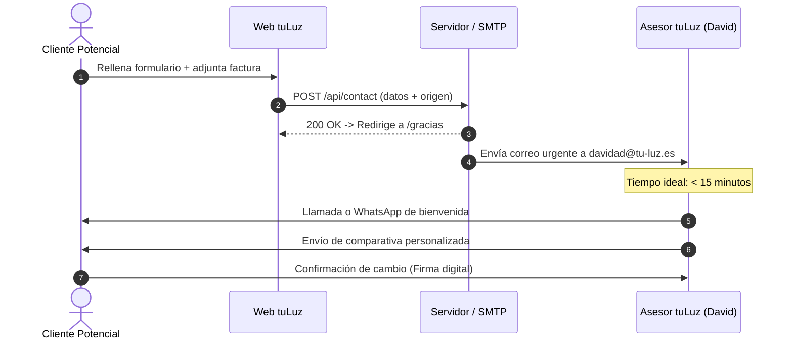

# Brief Estratégico Integral | tuLuz Asesoramiento Energético

---

## 1. Resumen Ejecutivo y Propósito de Marca

**tuLuz** es una consultora y plataforma de asesoramiento energético independiente con sede operativa en Córdoba y cobertura en **toda España**. Su misión es erradicar el sobrecoste sistemático que sufren hogares, negocios y comunidades en sus suministros de electricidad y gas natural, ofreciendo un servicio de auditoría, comparación y tramitación **100% gratuito, transparente y sin permanencia**.

### Promesa Central de Marca
> *"Claridad, ahorro y un futuro sostenible. Comparamos más de 50 comercializadoras para que pagues exactamente lo justo, sin letra pequeña ni trámites engorrosos."*

---

## 2. Pilares de Posicionamiento y Propuesta de Valor

| Pilar | Definición Estratégica | Impacto Percibido por el Cliente |
| :--- | :--- | :--- |
| **Independencia Real** | No atados a un único oligopolio. Comparativa activa entre +50 compañías (Endesa, Iberdrola, Naturgy, Repsol, TotalEnergies, Octopus, GNS, etc.). | Confianza y neutralidad absoluta. |
| **Servicio 100% Gratuito** | El cliente nunca paga nada; los honorarios proceden de las comisiones de gestión de las comercializadoras. | Barrera de entrada 0 (cero riesgo). |
| **Sin Cortes ni Molestias** | El cambio es puramente administrativo. El suministro nunca se interrumpe y la distribuidora sigue siendo la misma. | Tranquilidad operativa total. |
| **Acompañamiento Continuo** | Monitorización de fin de promociones y renovación automática antes de que la compañía suba tarifas. | Fidelización a largo plazo (LTV elevado). |

---

## 3. Segmentación de Audiencias (Buyer Personas)

```mermaid
flowchart TD
    ROOT["🎯 Segmentos Clave de tuLuz"]

    ROOT --> S1["🏡 Particulares y Hogares"]
    S1 --> S1_A["Ahorro directo en factura mensual"]
    S1 --> S1_B["Blindaje con tarifas fijas estables"]
    S1 --> S1_C["Auditoría sin cambiar de hábitos"]

    ROOT --> S2["🏢 Pymes y Comercios"]
    S2 --> S2_A["Ajuste de potencia contratada (P1-P6)"]
    S2 --> S2_B["Eliminación de penalización reactiva"]
    S2 --> S2_C["Reducción directa de costes operativos"]

    ROOT --> S3["👥 Comunidades de Propietarios"]
    S3 --> S3_A["Optimización en ascensores y zonas comunes"]
    S3 --> S3_B["Tarifas para calderas y gas centralizado"]
    S3 --> S3_C["Asesoría directa a Administradores de Fincas"]

    ROOT --> S4["☀️ Autoconsumo Solar"]
    S4 --> S4_A["Factura a 0€ con Batería Virtual"]
    S4 --> S4_B["Gestión de subvenciones y deducción IRPF"]
    S4 --> S4_C["Amortización garantizada en 3-5 años"]

    classDef main fill:#4CAF4F,stroke:#2e7d32,color:#ffffff,font-weight:bold;
    classDef seg fill:#e8f5e9,stroke:#4CAF4F,color:#1b5e20,font-weight:bold;
    classDef item fill:#ffffff,stroke:#cfd8dc,color:#263238;

    class ROOT main;
    class S1,S2,S3,S4 seg;
    class S1_A,S1_B,S1_C,S2_A,S2_B,S2_C,S3_A,S3_B,S3_C,S4_A,S4_B,S4_C item;
```

### Detalle por Segmento

#### 1. Hogares y Familias (Particulares)
* **Dolor:** Facturas abusivas, términos incomprensibles (término de potencia vs. energía, peajes, cargos regulados).
* **Propuesta:** Reducción de hasta un 35% mensual y blindaje contra subidas sorpresa.
* **Mensaje clave:** *"Envíanos una foto de tu última factura por WhatsApp y te decimos cuánto dinero estás perdiendo cada mes."*

#### 2. Pymes, Comercios e Industrias (Empresas)
* **Dolor:** Penalizaciones por maxímetro/reactiva, potencias sobredimensionadas, tarifas indexadas mal gestionadas.
* **Propuesta:** Estudio técnico de curvas de carga cuarto-horarias, optimización de tramos P1-P6 y negociación de pool mayorista.
* **Mensaje clave:** *"Convierte el gasto energético en ventaja competitiva: recortamos tu coste operativo sin inversión."*

#### 3. Comunidades de Vecinos y Administradores de Fincas
* **Dolor:** Derramas continuas por luz de escaleras, garajes, bombas de agua y gas centralizado.
* **Propuesta:** Facturación unificada, optimización de potencias de ascensores y tarifas comunitarias exclusivas.
* **Mensaje clave:** *"Baja la cuota de la comunidad revisando las facturas comunes a coste cero."*

#### 4. Prosumidores (Autoconsumo Solar y Batería Virtual)
* **Dolor:** Dudas sobre el coste de las placas, subvenciones y qué hacer con los excedentes solares.
* **Propuesta:** Proyecto llave en mano, cálculo de amortización en 3-5 años y compensación con batería virtual para factura a 0€.
* **Mensaje clave:** *"Paga 0 € de luz aprovechando el sol de Andalucía y toda España con batería virtual."*

---

## 4. Estrategia de Adquisición Digital por Plataforma

### 1. Google Ads (Search & Performance Max): Estrategia e Intenciones de Búsqueda Detalladas

Google Ads constituye el pilar de **captación de máxima intención transaccional**, interceptando al usuario exactamente en el momento en el que experimenta el dolor por una factura elevada o busca activamente una alternativa de ahorro.

#### A. Matriz de Intenciones de Búsqueda (Search Intents)

| Nivel de Intención | Perfil del Usuario y Momento Psicológico | Palabras Clave Clave (Keywords Modelo) | Propuesta de Valor y Copy de Anuncio | Página / Modal de Destino |
| :--- | :--- | :--- | :--- | :--- |
| **1. Transaccional de Alta Urgencia (BoFu)** | Usuario enfadado tras recibir una factura abusiva; busca cambiar de compañía o rebajar el coste de inmediato. | `[cambiar compania de luz]`, `"bajar factura luz urgente"`, `"asesoria energetica gratuita"`, `"tarifa luz mas barata sin permanencia"`, `"revisar factura luz gratis"` | *"¿Factura de luz abusiva? Comparamos +50 compañías y te decimos cuánto ahorras en 15 min. 100% gratis y sin cortes."* | `tu-luz.es/google` *(apertura directa de modal express)* |
| **2. Comparativa y Conquista (MoFu)** | Clientes de grandes oligopolios (Endesa, Iberdrola, Naturgy, Repsol) evaluando si existen tarifas mejores o qué compañía elegir. | `"mejor alternativa a endesa"`, `"cual es la compania de luz mas barata"`, `"comparador tarifas luz y gas 2026"`, `"companias de luz mas baratas que iberdrola"`, `"opiniones tarifas indexadas vs fijas"` | *"No te cases con ninguna eléctrica: auditamos tu contrato frente al mercado real sin compromiso ni coste para ti."* | `tu-luz.es/google` |
| **3. Solución Técnica B2B (Pymes y Negocios)** | Autónomos, hostelería, comercios e industrias con sobrecostes en potencias contratadas, maxímetros o penalizaciones. | `"asesor energetico empresas"`, `"reducir potencia contratada pyme"`, `"evitar penalizacion energia reactiva"`, `"tarifa luz 3.0TD barata"`, `"auditoria energetica comercios"` | *"Recorta hasta un 40% en los costes fijos de potencia y reactiva de tu empresa. Estudio de curvas cuarto-horarias sin inversión."* | `tu-luz.es/google` *(flujo pymes)* |
| **4. Solución Autoconsumo Solar y Batería Virtual** | Propietarios de viviendas unifamiliares o naves con alta factura eléctrica que buscan amortización y factura 0€. | `"bateria virtual cual es mejor"`, `"compensacion excedentes solares precio"`, `"subvenciones placas solares andalucia 2026"`, `"factura 0 euros luz solar"`, `"instalar paneles solares cordoba"` | *"Produce tu propia energía y acumula excedentes con batería virtual para llegar a 0 € de factura. Amortización en 3-5 años."* | `tu-luz.es/solar` |

#### B. Arquitectura de Campañas en la Cuenta (Account Structure)
* **Campaña 1: SEARCH - Transaccional Particulares (Exacta y Frase):**
  - Grupos de anuncios segmentados por temática (STAG): `[Ahorro Factura]`, `[Cambio Compañía]`, `[Comparador Gratuito]`.
  - Enfoque: Maximizar volumen de captación doméstica con CPA controlado.
* **Campaña 2: SEARCH - B2B Pymes y Comercios:**
  - Grupos: `[Optimización Potencia]`, `[Eliminar Reactiva]`, `[Tarifas Negocios 3.0TD/6.X]`.
  - Enfoque: Captación de suministros de alto consumo con valor por contrato (LTV) elevado.
* **Campaña 3: SEARCH - Autoconsumo Fotovoltaico y Batería Virtual:**
  - Grupos: `[Batería Virtual Excedentes]`, `[Instalación Placas Hogar]`, `[Subvenciones/IRPF]`.
  - Enfoque: Clientes de alto ticket medio interesados en independencia energética.
* **Campaña 4: SEARCH - Conquista Competitiva Neutral:**
  - Pujas en frase para términos de operadoras tradicionales (`"cambiar de endesa a otra"`, `"reclamar factura iberdrola tarifa"`).
  - Copy neutral: Comparativa independiente y cálculo de sobrecoste sin infringir políticas de marca.
* **Campaña 5: PERFORMANCE MAX (PMax) - Apoyo y Retargeting Inteligente:**
  - Se activa tras acumular más de 30 conversiones en Search para alimentar las señales de audiencia (*visitantes de web que no adjuntaron factura*).

#### C. Estrategia de Concordancias y Negativización Estricta
* **Concordancias permitidas:** Únicamente **Concordancia de Frase (`"..."`)** y **Concordancia Exacta (`[...]`)** para blindar el presupuesto contra tráfico de baja calidad. Queda desaconsejada la concordancia amplia en fases 1 y 2.
* **Lista Maestra de Palabras Clave Negativas (Exclusiones Obligatorias):**
  - *Laboral y Formación:* `empleo`, `trabajar en`, `curriculum`, `sueldo`, `convenio`, `curso`, `oposiciones`.
  - *Distribuidora y Averías:* `averias telefono`, `corte de luz hoy`, `distribuidora telefono gratuito`, `dar lectura contador`, `reparar instalacion`.
  - *Facturación Pasada / Gestión Interna:* `bono social requisitos`, `pagar recibo online`, `reclamar factura cobrada`, `descargar certificado`.
  - *Tráfico Irreal / Fraude:* `enganchar la luz gratis`, `trucar contador digital`, `luz gratis truco`, `piratear contador`.

#### D. Textos de Anuncios Adaptables (RSA) y Activos de Alto Rendimiento
* **Títulos dinámicos de alto CTR:**
  - *"Baja tu Factura de la Luz Hoy"*
  - *"Estudio Energético 100% Gratuito"*
  - *"Comparamos +50 Compañías de Luz"*
  - *"¿Pagas de Más? Descúbrelo Gratis"*
  - *"Ahorra hasta un 35% en tu Recibo"*
  - Inserción de ubicación geográfica dinámica: *"{LOCATION(City)}: Asesoría de Luz Gratuita"*.
* **Extensiones / Activos indispensables:**
  - *Enlaces de sitio (Sitelinks):* «Estudio para Hogares», «Ahorro para Pymes», «Autoconsumo y Batería Virtual», «Cómo Trabajamos (Sin Coste)».
  - *Textos destacados (Callouts):* «Sin Permanencia», «Cambio 100% Administrativo», «Sin Cortes de Suministro», «Trato Humano por WhatsApp».
  - *Extractos estructurados:* Servicios: «Auditoría de Factura», «Optimización de Potencia», «Tarifas Fijas y Flexibles», «Batería Virtual».

#### E. Hoja de Ruta de Pujas y Optimización (Bidding Roadmap)
1. **Fase de Arranque (Semanas 1 y 2):** Estrategia de *Maximizar Clics con Límite de Puja Máxima (CPC Máx: 0,85 € - 1,20 €)*. El objetivo es forzar impresiones a coste controlado, analizar términos de búsqueda reales y añadir negativas a diario.
2. **Fase de Consolidación (Semanas 3 a 6):** Transición a *Maximizar Conversiones* en cuanto la cuenta registre al menos 15-20 eventos `generate_lead` válidos.
3. **Fase de Escala (Semana 7 en adelante):** Activación de *CPA Objetivo (tCPA)* fijado entre 7,00 € y 11,00 € por lead para estabilizar el margen y escalar el volumen de inversión de forma rentable.

### 2. Meta Ads (Facebook & Instagram)
* **Objetivo:** Impactar visualmente con anuncios comparativos ("Antes vs. Después en tu factura") y captar leads a menor coste por adquisición.
* **Formatos top:** 
  - Vídeos tipo Reel mostrando una factura real con rotulador rojo tachando el sobrecoste.
  - Carruseles de casos de éxito (Familia Pérez: 48€/mes de ahorro; Panadería: 280€/mes).
* **Ruta de destino:** `https://tu-luz.es/meta` o `https://tu-luz.es/instagram`.

### 3. TikTok Ads
* **Objetivo:** Volumen alto a bajo coste; desmontar mitos y engaños de las grandes eléctricas.
* **Estilo de contenido:** UGC (User Generated Content), lenguaje coloquial, ritmo dinámico. *"3 cosas que tu compañía de luz te está cobrando y que no deberías pagar"*.
* **Ruta de destino:** `https://tu-luz.es/tiktok`.

---

## 5. Arquitectura del Embudo y Atribución Técnica

| Canal | Enlace de Entrada | Metatítulo en GA4 | Evento Conversión |
| :--- | :--- | :--- | :--- |
| **Google Ads** | `tu-luz.es/google` | `[Google Ads] Solicita tu Estudio...` | `generate_lead` + visita a `/gracias` |
| **Meta Ads** | `tu-luz.es/meta` | `[Meta Ads] Solicita tu Estudio...` | `generate_lead` + visita a `/gracias` |
| **Instagram** | `tu-luz.es/instagram` | `[Instagram Ads] Solicita tu Estudio...` | `generate_lead` + visita a `/gracias` |
| **TikTok** | `tu-luz.es/tiktok` | `[TikTok Ads] Solicita tu Estudio...` | `generate_lead` + visita a `/gracias` |
| **Solar / Promo** | `tu-luz.es/solar` | `Autoconsumo Solar y Placas...` | `generate_lead` + visita a `/gracias` |
| **Orgánico / Directo** | `tu-luz.es/` | `tuLuz \| Asesoramiento Energético...` | `generate_lead` + visita a `/gracias` |

### Protección SEO y Privacidad
1. **Directiva `noindex, nofollow`:** Todas las URLs de campaña (`/google`, `/meta`, `/tiktok`, etc.) y la página `/gracias` están blindadas contra indexación para proteger el SEO y evitar falsos positivos en analítica.
2. **Endpoint privado de leads:** `/api/leads-summary?key=ADMIN_KEY` protegido bajo token para cumplimiento estricto del RGPD.

---

## 6. Protocolo de Gestión de Leads y Conversión Comercial (SOP)

El factor crítico que determina la rentabilidad de las campañas de publicidad es la **velocidad de respuesta** (Speed-to-Lead):

### Reglas de Oro en la Gestión Comercial:
1. **Contacto en menos de 15 minutos:** Multiplica por 7 la probabilidad de cierre frente a responder horas después.
2. **Canal preferente WhatsApp:** Para particulares y autónomos, escribir un mensaje cordial por WhatsApp citando su nombre antes de llamar aumenta la tasa de respuesta un 60%.
3. **Presentación de la oferta:** No hablar de kilovatios o tecnicismos; hablar siempre de **ahorro en euros al mes y al año**.

---

## 7. Cuadro de Mandos y KPIs de Negocio

| Indicador (KPI) | Objetivo Inicial (Fase 1) | Objetivo Escala (Fase 2) | Herramienta |
| :--- | :--- | :--- | :--- |
| **Coste por Lead (CPL - Google)** | < 12 € / lead | < 8 € / lead | Google Ads |
| **Coste por Lead (CPL - Meta/TikTok)** | < 6 € / lead | < 3,50 € / lead | Meta / TikTok Ads |
| **Tasa de Conversión Web (CR)** | > 5,0 % | > 8,5 % | GA4 |
| **Tasa de Contactabilidad** | > 75 % de leads atendidos | > 85 % | CRM / Email |
| **Tasa de Cierre (Lead a Contrato)** | > 28 % | > 35 % | Registro Interno |
| **Ahorro Medio por Cliente** | > 180 €/año (Hogar) | > 1.200 €/año (Pyme) | Informes tuLuz |

---

## 8. Hoja de Ruta de Crecimiento (Roadmap)

### Fase 1: Consolidación y Adquisición Rápida (Meses 1-2)
* Activar campañas en Google Ads para términos de alta intención.
* Campañas de captación visual en Meta e Instagram Reels.
* Optimización continua de las páginas de destino y velocidad de contacto telefónico.

### Fase 2: Escala y Alianzas (Meses 3-4)
* Lanzamiento de campañas de captación en TikTok Ads con vídeos educativos cortos.
* Programa de acuerdos directos con Administradores de Fincas y Gestorías en Andalucía y resto de España.
* Campañas estacionales de autoconsumo fotovoltaico y batería virtual.

### Fase 3: Automatización y Retención (Meses 5-6)
* Implementación de avisos automáticos al cliente 30 días antes del vencimiento de su contrato anual para renovar con la tarifa más barata del momento.
* Programa de referidos: *"Recomienda tuLuz a un familiar y recibe incentivos"*.
